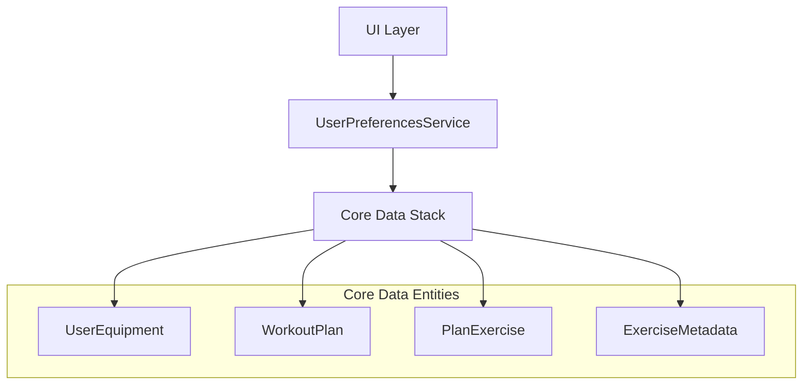

# Design Document

## Overview

This design implements persistent storage for user equipment selections and workout plans in VoltLift using Core Data. The system extends the existing Core Data model with new entities to store user preferences and workout plans, ensuring data persists across app sessions while maintaining VoltLift's focus on simplicity and reliability.

## Architecture

### High-Level Architecture



### Data Flow

1. **App Launch**: UserPreferencesService checks for existing equipment/plans
2. **Equipment Selection**: User selections are immediately persisted via UserPreferencesService
3. **Plan Generation**: Generated plans are automatically saved with metadata
4. **Plan Access**: Saved plans are loaded and presented through the service layer

## Components and Interfaces

### Core Data Model Extensions

#### UserEquipment Entity
```swift
@objc(UserEquipment)
public class UserEquipment: NSManagedObject {
    @NSManaged public var equipmentId: String
    @NSManaged public var name: String
    @NSManaged public var isSelected: Bool
    @NSManaged public var dateAdded: Date
    @NSManaged public var category: String?
}
```

#### WorkoutPlan Entity
```swift
@objc(WorkoutPlan)
public class WorkoutPlan: NSManagedObject {
    @NSManaged public var planId: UUID
    @NSManaged public var name: String
    @NSManaged public var createdDate: Date
    @NSManaged public var lastUsedDate: Date?
    @NSManaged public var exerciseCount: Int32
    @NSManaged public var planData: Data // JSON serialized plan
    @NSManaged public var exercises: NSSet?
}
```

#### PlanExercise Entity
```swift
@objc(PlanExercise)
public class PlanExercise: NSManagedObject {
    @NSManaged public var exerciseId: UUID
    @NSManaged public var name: String
    @NSManaged public var sets: Int32
    @NSManaged public var reps: Int32
    @NSManaged public var weight: Double
    @NSManaged public var restTime: Int32
    @NSManaged public var orderIndex: Int32
    @NSManaged public var workoutPlan: WorkoutPlan?
}
```

### Service Layer

#### UserPreferencesService
```swift
@MainActor
class UserPreferencesService: ObservableObject {
    @Published var selectedEquipment: [EquipmentItem] = []
    @Published var savedPlans: [WorkoutPlan] = []
    @Published var hasCompletedSetup: Bool = false
    
    private let persistenceController: PersistenceController
    
    // Equipment Management
    func loadSelectedEquipment() async
    func saveEquipmentSelection(_ equipment: [EquipmentItem]) async
    func updateEquipmentSelection(_ equipment: EquipmentItem, isSelected: Bool) async
    
    // Plan Management
    func loadSavedPlans() async
    func savePlan(_ plan: WorkoutPlanData, name: String) async
    func deletePlan(_ planId: UUID) async
    func renamePlan(_ planId: UUID, newName: String) async
    func markPlanAsUsed(_ planId: UUID) async
    
    // Setup State
    func checkSetupCompletion() async
    func markSetupComplete() async
}
```

#### Data Transfer Objects
```swift
struct EquipmentItem: Identifiable, Codable {
    let id: String
    let name: String
    let category: String
    var isSelected: Bool
}

struct WorkoutPlanData: Identifiable, Codable {
    let id: UUID
    let name: String
    let exercises: [ExerciseData]
    let createdDate: Date
    let lastUsedDate: Date?
}

struct ExerciseData: Identifiable, Codable {
    let id: UUID
    let name: String
    let sets: Int
    let reps: Int
    let weight: Double
    let restTime: Int
}
```

### UI Integration Points

#### Equipment Selection Flow
- Modify existing equipment selection to use UserPreferencesService
- Add persistence calls after user selections
- Show loading states during data operations

#### Plan Management Interface
- New SavedPlansView for displaying saved plans
- Plan management actions (rename, delete) in context menus
- Integration with existing workout flow

#### Settings Integration
- Add equipment management section in Settings tab
- Option to reset all preferences
- Data export/import capabilities (future)

## Data Models

### Core Data Schema Updates

```xml
<!-- UserEquipment Entity -->
<entity name="UserEquipment" representedClassName="UserEquipment" syncable="YES" codeGenerationType="class">
    <attribute name="equipmentId" attributeType="String"/>
    <attribute name="name" attributeType="String"/>
    <attribute name="isSelected" attributeType="Boolean" usesScalarValueType="YES"/>
    <attribute name="dateAdded" attributeType="Date" usesScalarValueType="NO"/>
    <attribute name="category" optional="YES" attributeType="String"/>
</entity>

<!-- WorkoutPlan Entity -->
<entity name="WorkoutPlan" representedClassName="WorkoutPlan" syncable="YES" codeGenerationType="class">
    <attribute name="planId" attributeType="UUID" usesScalarValueType="NO"/>
    <attribute name="name" attributeType="String"/>
    <attribute name="createdDate" attributeType="Date" usesScalarValueType="NO"/>
    <attribute name="lastUsedDate" optional="YES" attributeType="Date" usesScalarValueType="NO"/>
    <attribute name="exerciseCount" attributeType="Integer 32" defaultValueString="0" usesScalarValueType="YES"/>
    <attribute name="planData" attributeType="Binary"/>
    <relationship name="exercises" optional="YES" toMany="YES" deletionRule="Cascade" destinationEntity="PlanExercise" inverseName="workoutPlan"/>
</entity>

<!-- PlanExercise Entity -->
<entity name="PlanExercise" representedClassName="PlanExercise" syncable="YES" codeGenerationType="class">
    <attribute name="exerciseId" attributeType="UUID" usesScalarValueType="NO"/>
    <attribute name="name" attributeType="String"/>
    <attribute name="sets" attributeType="Integer 32" usesScalarValueType="YES"/>
    <attribute name="reps" attributeType="Integer 32" usesScalarValueType="YES"/>
    <attribute name="weight" attributeType="Double" defaultValueString="0.0" usesScalarValueType="YES"/>
    <attribute name="restTime" attributeType="Integer 32" usesScalarValueType="YES"/>
    <attribute name="orderIndex" attributeType="Integer 32" usesScalarValueType="YES"/>
    <relationship name="workoutPlan" optional="YES" maxCount="1" deletionRule="Nullify" destinationEntity="WorkoutPlan" inverseName="exercises"/>
</entity>
```


## Error Handling

### Data Persistence Errors
- **Save Failures**: Retry mechanism with exponential backoff
- **Load Failures**: Graceful degradation to default state
- **Corruption Detection**: Data validation with recovery options

### User Experience
- **Loading States**: Show progress indicators during data operations
- **Error Messages**: User-friendly error descriptions
- **Recovery Actions**: Clear options for users to resolve issues
- **Offline Support**: Full functionality without network dependency

### Error Recovery Patterns
```swift
enum UserPreferencesError: LocalizedError {
    case saveFailure(underlying: Error)
    case loadFailure(underlying: Error)
    case dataCorruption
    
    var errorDescription: String? {
        switch self {
        case .saveFailure:
            return "Failed to save your preferences. Please try again."
        case .loadFailure:
            return "Unable to load your saved data. Using defaults."
        case .dataCorruption:
            return "Data corruption detected. Preferences will be reset."
        }
    }
}
```

## Testing Strategy

### Unit Tests
- **UserPreferencesService**: Test all CRUD operations
- **Core Data Operations**: Test entity creation, updates, deletions
- **Error Handling**: Test failure scenarios and recovery

### Integration Tests
- **End-to-End Flows**: Equipment selection → persistence → reload
- **Plan Management**: Create → save → load → modify → delete
- **Performance Testing**: Large datasets and concurrent operations

### UI Tests
- **Equipment Selection Flow**: Verify persistence across app restarts
- **Plan Management UI**: Test all user interactions
- **Error State Handling**: Verify error messages and recovery options
- **Accessibility**: Ensure all new UI elements are accessible

### Test Data Management
```swift
extension PersistenceController {
    static var testing: PersistenceController = {
        let controller = PersistenceController(inMemory: true)
        // Populate with test data
        return controller
    }()
}
```

### Performance Considerations
- **Lazy Loading**: Load plans on-demand to reduce memory usage
- **Background Processing**: Perform saves on background contexts
- **Batch Operations**: Use batch requests for bulk operations
- **Memory Management**: Proper cleanup of managed objects

This design ensures robust persistence of user preferences while maintaining VoltLift's commitment to simplicity and reliability. The modular architecture allows for future enhancements while keeping the core functionality focused and performant.